<!-- KyoTranDev -->

<h2 align="center">🚀 Welcome to My GitHub Profile! 🚀</h2>

Full-Stack Developer | Indie Hacker | Passionate About AI-Powered Dev Tools | Always Learning

---

## 🛠️ Tech Stack

  
  
  
  
  
  
  
  
  
  
  
  
  
  
  

## 🤖 AI Development Tools

  
  
  
  
  

---

<h2 align="center">📈 GitHub Stats</h2>

  

  

  

---

<h2 align="center">🌱 Currently Working On</h2>

  Building AI-integrated apps, optimizing developer workflows, and exploring indie product ideas. Stay tuned for my upcoming projects and contributions!

---

## 🔗 Connect With Me
<!-- https://icons8.com -->

  
  
  
  

